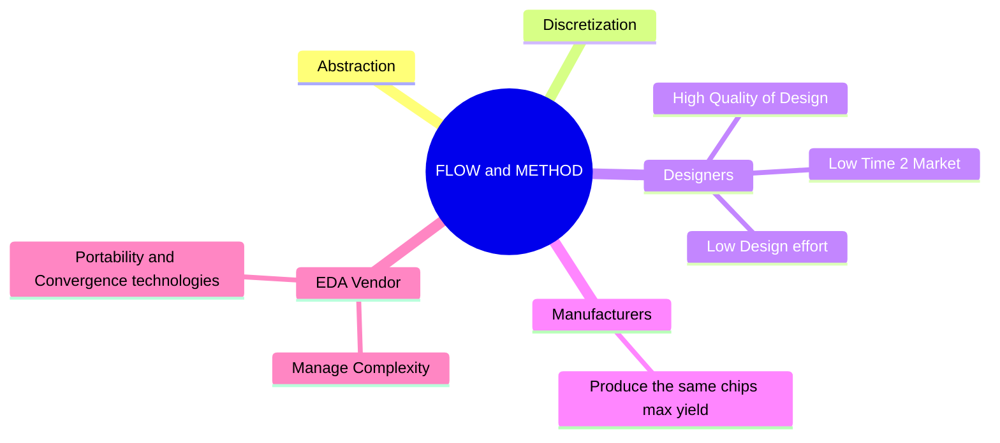

# Sources 

Suggestes Textbooks:
 - [Synthesis and Optimization of Digital Circuits, G. De Micheli, McGraw-Hill, 1994](https://openlibrary.org/books/OL1432084M/Synthesis_and_optimization_of_digital_circuits)  
 - [High-Level Synthesis: Introduction to Chip and System Design, D. Gajski, N. Dutt, A. C-H Wu, S. Y-L Lin, Springer, 2012](https://openlibrary.org/works/OL18247032W/High-level_synthesis?edition=key%3A/books/OL1560195M)
 
# Course info 
Professor: Andrea Calimera => Low power design research  
Email: [andrea.calimera@polito.it](mailto::andrea.calimera@polito.it) 

Lab Assistant: Valentino Peluso  
Email: [valentino.peluso@polito.it](mailto::valentino.peluso@polito.it)

Exam Rules:
 - Written part exercises + theory => 27/30 
 - Project: EDA contest, group Project 3 points (+3 if you win the contest)
> [!DANGER] Project deadline end of June 

## Laboratory Schedule

# Introduction 

We will analyze the physical level of a circuit it's: Synthesis.

The eMarket is driven by [[1740666919-iot-device|IoT Devices]] this nodes have to be **autonomous end nodes** :
    - Sensing: the nodes capture data 
    - Sensemaking: 
        - they need to make decisions => Machine Learning, can help reduce the mount of resources needed to take decisions. 
But this brings => Design challenges:
- Integrate a lot of sensors in a small package ([[1740667292-heterogeneous-integration-hi|Heterogeneous integration (HI)]]) ([[1740667815-multi-core|Multi Core]])
- Resource and Efficiency Gap: do the computation of a normal CPU in a MCU 

This while keeping 
- Keep Low power usage => **Energy Efficiency** 
- Keep Low cost

> [!CAUTION]  Do more with less

Manufacturers can achieve this goals with => [[1740669411-technology-scaling-ts|Technology scaling (TS)]] 

TS => Helps to have faster MCU but it is not free performance 
we need to keep an eye on **Power**, **Aging** and **Process Variation**

We hit a power wall => [[1741188238-dark-silicon|Dark Silicon]].
As the manufacturers capabilities ends at some points further optimizations can be done, by the Designers, via: 
[[1740670007-architectural-scaling|Architectural Scaling]] 

=> this moved the industry towards [[1740667815-multi-core|Multi Core]] silicons.

But today applications are data intensive
 - Memory is a bottleneck => we need to move data from CPU to memory ([[1740670374-memory-wall|Memory Wall]])
 - We switch to dataflow cores => [[1740670519-hardware-accelerator|Hardware Accelerator]], cored designed to perform very well specific operations (like matrix operations for ML) 
     
=> [[1740667292-heterogeneous-integration-hi|Heterogeneous]] architectures multi-core + accelerators
[[1740669411-technology-scaling-ts|Technology scaling (TS)]] + [[1740670007-architectural-scaling|Architectural Scaling]] = A lot of Complexity  
- Technology scaling brings
    - Leakage and power 
    - Temperature 
    - [[1740682683-process-variation|Process Variation]]
- Manage multi processing units with [[1740667292-heterogeneous-integration-hi|Heterogeneous integration (HI)]] 
    - they need to be synchronized 
    - they need to be programmed

[[1740671372-electronic-design-automation-eda|Electronic Design Automation (EDA)]] is introduced to reduce the difficulties in design 
- Brings Efficiency and productivity 
- set of automatic tools for 
    - **Optimization**
    - **Verification** (simulation)

For example if we want to manufacture an inverter to have a precise $f_{\text{clk}} = \frac{1}{Dp = \text{Delay Propagation}}$, 
what information the manufacturer (Si Producer) needs? 
- we need to size the NMOS (on the left [^1])
    - channel length
    - all the sizes 
    - Doping
    - Size of the substrate
    - a lot of variables 
- then how we place the transistors?
    - Layout (on the right[^1]) => top view of the regions => a map of the chip and the interconnections  
    - You need to assert all the sizes of the interconnections => a lot of variables 

Actually we are not solving the Designer Complexity, we are only moving them form the designer to the EDA 
vendor, so the overall design **Complexity** is shared between: 
- Designers => they want a low time 2 market
- Si Vendors (Manufacturers) => they want to produce the same chips => less cost they have to make only one mask
- EDA Vendor => they want to manage complexity

- [[1740671482-bulk-cmos|Bulk CMOS]]
- [[1740671504-fd-soi|FD-SOI]]
- [[1740671549-dtmos|DTMOS]]
- [[1740728660-bdcmos|BDCMOS]]
- [[1740672093-nmos|NMOS]]
- [[1740728887-inverter|Inverter]]
- [[1740732718-tool-command-language-tcl|Tool Command Language (TCL)]]

[^1]: 

## [[1741595972-design-flow-and-method-sods|Design Flow and Method (SODS)]]
[[1741601698-y-chart|Y chart]]

----------

# Hardware Modeling
[[1741793750-hardware-modeling|Hardware Modeling]]

----------
# Arch level S&O
## Scheduling
define start time operations:
 - Unconstrained => ASAP (As soon as possible)
 - Constrained:
    - Latency constraint => ALAP (As Late As Possible)
    - Area Constraint 

Objective space exploration?

the mobility gives the tange margin before the time constrint is violated

## To exploare pareto we use the List_Scheduling_for_minimum resurces 
 - we schedule based on the lower or zero slack
 slack => remaining timing margin, calculated by: t^l_i-l
## Sharing 
## Binding

# Laboratory Sessions 

## Lab0

- [[1741101916-high-level-synthesis|High Level Synthesis]]
- [[1741192926-low-level-synthesis|Low Level Synthesis]]
### Physical Design
[[1741102207-physical-design|Physical Design]] (Add tool example);
- [[1741102152-floorplanning|Floorplanning]]
- [[1741102160-placement|Placement]]
- [[1741102180-logic-refinement|Logic Refinement]]
- [[1741102232-clock-tree-synthesis|Clock Tree Synthesis]]
- [[1741102239-routing|Routing]] => post  routing optimizations
### Physical Verification
### IC Package Design
### Logic Design +++ 
synthesys steps:
- Standard design flow with synopsys tools: 
    - Synthesys 
    - static timing 
    - post synthesys simulaiton 
- Analyze the curcuit
    - analyze the cicuit
- Post synthesys optimizations

