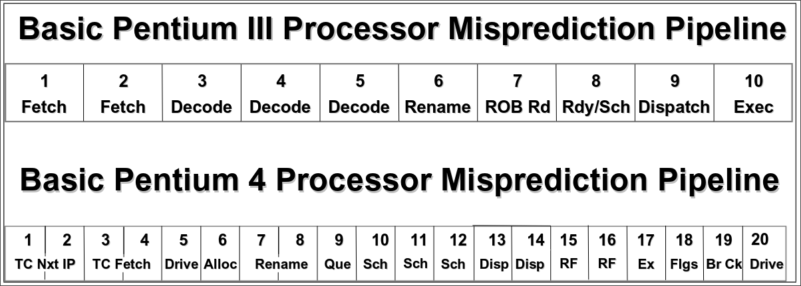
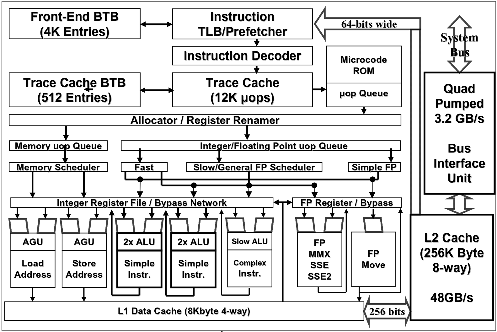

The Pentium 4 is an Intel microprocessor. It is a [[1740926407-cisc|CISC]] architecture 
but it is structured as a [[1740926407-cisc|CISC]] outer shell and an internal 
[[1740926402-risc|RISC]] superscalar micro-architecture. 

> [!IMPORTANT]
> The purpose of the CISC shell is to maintain **binary compatibility**
> and the necessity of a RISC processor is to increase performance

This architecture is based on the translation of CISC instructions called **macro-Instruction** 
into simpler and RISC compatible instructions called **micro-Instruction** or ***uops***. Let's analyze an 
example:
 - **macro-Instructions**: add add BX to mem(AX) and store in mem(AX) 
 $$
    ADD\ (\%AX),\ \%BX
 $$
 - **uops** translation result:
 $$
    LD\ \%R2, (\%R1)\\ 
    ADD\ \%R3, \%R2\\ 
    ST\ \%R3, (\%R1)\\ 
 $$
the macro-instruction wants to add a value to a memory location, in x86 assembly it is 
dove via a single instruction. Meanwhile in a RISC architecture the same operation is performed by:
 - getting the value from the memory 
 - performing the addition
 - storing the result in memory 

> [!IMPORTANT] uops optimizations
> the goal of the uops is to reduce the complexity of the decode and execution unit. As the 
> instructions are less and simpler the optimizations are more straightforward then a CISC

> [!IMPORTANT] Futureproof
> An architecture that performs this type of translations can change it's internal RISC 
> design without changing the outer interface

while the example and most macro-instructions can be translated form one to one or 
three uops, some complex instructions require a lot of uops, thus to optimize the 
translation an instruction ROM is introduced. The content of the ROM is the translation 
of the complex macro-Instruction, the content of the ROM is called **microcode**, an example
of complex instructions could be the boot, reset or interrupt handlers.

# General Organization
The general operations performed by the P4 are:
 - Fetch macro-instruction **In Order**
 - Translate each macro-instruction into a stream of uops 
 - Execute the uops with a superscalar **Out of Order** organization 
 - Commits the result of the uops **In Order** 

The whole pipeline is 20 cycles long an it is organized in four main sections:
 - [[#In Order Front End]] pipeline: fetches the instructions to be executed. It has an accurate  
 [[1743170781-branch-prediction|Branch Prediction]], the predicted instruction address is used to 
 fetch instructions form the **Level 2 (L2)** cache an translate them in uops to be placed 
 in a **Level 1 (L1)** cache for the OoO engine to be picked this cache is the [[#Trace Cache]].  
 - [[#Out of Order Engine]]: is where the instructions are prepared for execution. The instructions 
 are severely reordered to allow a faster execution, as soon as their operands are ready. This 
 [[1740401450-out-of-order-execution|OoO]] allows resources such as the ALU and the cache 
 to be kept busy as much as possible. This block also contains a [[#Retiring]] block which reorders 
 the instructions back to the original flow, it also tells to the [[#BTB]] informations on the execution 
 to keep track of the branches.
 - [[#Integer and Floating point unit]] execution pipeline: is where the instructions are executed. 
 It includes a **[[1743240510-register-file|Register File]]** to store the integers an floating-points
 data operands that the instructions needs in order to execute. It also contains a **Level 1 (L1)** data
 cache to perform load and store operations.
 -[[#Memory Subsystem]]: it contains the **L2** cache and system bus. The purpose of the L2 cache is 
 to store both instructions and data that cannot fit in the **Execution Trace Cache** and the **L1**
 cache. The external system bus is connected to the backside of the L2 cache and it is used to 
 access the main memory in case of: miss, replace and access to I/O. 

General layout:

# In Order Front End 
It consists in several units it has:
 - [[#Instruction TLB]]
 - Front end branch predictor [[#BTB]]
 - An [[#IA-32 Instruction Decoder]]
 - [[#Trace Cache]]
 - [[#Microcode ROM]]
 - [[#Trace Cache BTB]]

## Trace Cache
The Trace Cache is the primary or Level 1 (L1)
instruction cache of the Pentium 4 processor and delivers
up to three uops per clock to the out-of-order execution
logic.
It stores already decoded instructions removes the IA-32 decoding from the main
execution loop. Typically the instructions are decoded once and placed in the 
Trace Cache and then used repeatedly from there like a normal instruction cache on
previous machines. 
> [!IMPORTANT]
> The IA-32 instruction decoder is only used when the machine misses the Trace Cache and needs
> to go to the L2 cache to get and decode new IA-32 instruction bytes.

> [!IMPORTANT]
> The uops that come from the Trace Cache and the microcode ROM are buffered in a simple, in-order uop
> queue that helps smooth the flow of uops going to the out-of-order execution engine.

### Trace Cache BTB
There is a smaller BTB compared to the general front-end [[#BTB]] as it's main purpose is to 
handle the predicts in a much smaller subset of the program currently handled by the Trace Cache. 

### Microcode ROM
it is used to translate complex IA-32 instructions. When a complex instruction needs to be decoded, 
the Trace cache jumps to the microcode ROM which issues the uops needed for the translations. 

## Instruction TLB
This module and the [[#BTB]] are used when there is a cache miss in the [[#Trace Cache]].
The ITLB translates the instruction pointer ([[1741965815-virtual-memory|virtual Memory]]) to a 
physical address to access the L2 cache, it includes also a page protection mechanism.
In case of a miss in the TLB will cause the system to load a page in cache before continuing.
> [!IMPORTANT]
> It will be the OS to handle the page fault

## BTB
The instruction pre-fetcher is driven by the BTB to know what to fetch next ([[1743170781-branch-prediction|Branch Prediction]]).

## IA-32 Instruction Decoder
It receives IA-32 instruction bytes from the L2 cache 64-bits 
at a time and decodes them into uops. This single instruction decoder 
can decode at a maximum rate of one IA-32 instruction per clock cycle. 
Many IA-32 instructions are converted into a single uop, and others 
need several uops to complete the full operation. If more than four 
uops are needed to complete an IA-32 instruction, the decoder 
sends the machine into the microcode ROM to do the instruction. 
Most instructions do not need to jump to the microcode ROM to complete.

## Fetch and Decode Flow (Queue)
Using the address determined by the [[#Trace Cache BTB]] the trace cache is read, in case of a miss 
the needed instruction is loaded from the L2 cache.
The data read from the L2 cache then flows through the front-end pipeline to be decoded and loaded into the trace
cache. If there is a trace cache hit, the trace cache delivers up to 3 uops per cycle. Some uops
read from the trace cache are actually pointers to uop routines stored in the microcode ROM.
In this case, the ROM is read and it begins feeding uops into the execution pipeline instead.
This allows macro-instructions that must be translated into large numbers of uops to not take
up space in the trace cache.

# Out of Order Engine 

## Allocator

## Register Renaming

## uOPS Queue

## Scheduling & Dispaching 

## Retiring

# Integer and Floating point unit

# Memory Subsystem
