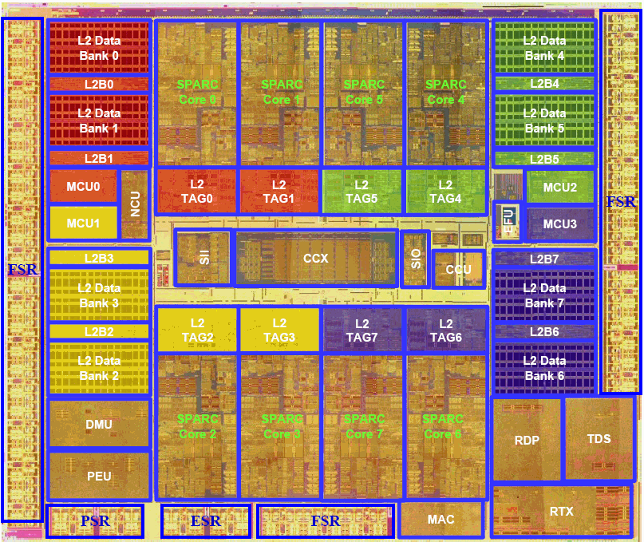

The UltraSPARC T2 is one of the first server grade chips. It packages 8 cores with 8 threads each 
and integrates all basic functionalities in the chip like: networking, security, I/0 and 
it is build to be used with Solaris OS. 

The principle on which the T2 is based is **throughput computing**. As single core and single thread 
cores are bottlenecked by memory operations, with may available threads it is possible to find 
something to execute every cycle. The solution could be two: increasing the number of cores 
or increasing the number of threads each core can handle, and the T2 is based on the latter one, as the 
first one would require a lot of area. 
> [!IMPORTANT]
> Increasing the number of threads a core can handle is more area efficient rather than increasing the number of 
> cores

# General Organization

The T2 supports eight fully pipelined floating-point units and eight cryptographic units one per core. 
Eight banks of 4Mb L2 cache are shared among all cores and four dual-channel memory controllers connect 
the L2 cache with the external memory. 

Each SPARC core has 16Kb 8-way associative instruction cache and a 8Kb 4-way associative data cache, 64 entry
fully associative instruction TLB and a 128 entry fully associative data TLB shared by the eight threads.

## Crossbar 

The eight SPARC cores are connected through a interconnection mechanism called **crossbar** to the L2 cache and I/O.
It works at the same clock speed as the core. 

There is a crossbar switch that allows the connection of each core with every bank of L2 cache and vice-versa:
 - **PCX**: Processor to Cache operation 
 - **CPX**: Cache to Processor operation

## L2 Cache

The access to the cache in managed by an arbiter and a pipeline 16 FIFO entries. Each block performs 
arbitration in case of request for the same target and an independent arbitration for each source-target 
couple occurs. Every target has its own arbiter and every target can arbiter independently and 
simultaneously. The cache management is thus pipelined, for example the PCX pipelined has three stages:
 - **REQUEST**: a SPARC core issues the request
 - **ARBITRATION**: the cores send packets to the PCX, the OCX queues the packets and performs 
 arbitration for the target and grant to the muxes
 - **TRANSMIT**: the PCX transmit the grant to the core to perform the transaction on the muxes. 

### Arbiter

The input register receives vectors of requests and are organized in a FIFO buffer. Each request
is built by $M$ bits, one for each possible source. It ensures that requests are processed in age-order with 
the grant signal.

The request register contains the request vector currently processed, it can be loaded from three sources: 
 - request vector until all requests are processed 
 - FIFO
 - Input Register 

# T2 Core 
As stated before each core can manage up to eight threads, furthermore it has **two integer execution pipelines**,
 **one floating-point execution pipeline** and one memory pipeline.  

 - IFU: Instruction Fetch Unit 
 - EXU0/EXU1: Integer Execution Units 
 - LSU: Load/Store Unit 
 - FGU: Floating-Point/Graphical Unit 
 - SPU: Stream Processing Unit/Cryptographic Coprocessor
 - TLU: Trap Logic Unit (Interrupt handler)
 - MMU: Memory Management Unit 

The floating-point unit and memory pipelines are shared by all eight threads. The wight threads are 
partitioned in two groups of four and the four threads within a group share a single integer pipeline. 
While all eight threads run simultaneously, at any given time **at most two threads will be active in the physical core**.
This streams (strands for a SUN microsystem enjoyer) are switched on a cycle-by-cycle basis between the available 
threads within the two partitions with a **least recently used** priority scheme. When a stream encounters a long 
latency event, for example a cache miss, it is marked unavailable and instructions will not be issued from that stream 
until the operation is resolved. Execution of the remaining available threads will continue while le long lantecy event 
of the first stream is resolved. The SPARC core can handle at most one long latency instruction per thread.

The hardware support consists of a full [[1743240510-register-file|register file]]. The eight threads share the instructions and 
data caches and the TLB with an auto de-map feature to allow multiple threads to update without locking the TLB. 
(auto de-map is the hardware capability to invalidate an address, without it an OS would be responsible for it).

# T2 Pipeline

## Integer Pipeline
The integer Pipeline has eight stages:

 - Fetch (F)
 - Cache (C)
 - Pick (P)
 - Decode (D) and read Integer Register File (IRF)
 - Execute (E), read the Floating Point Register File (FRF) and forward EXU data
 - Memory (M) and forward of EXU data 
 - Bypass (B), EXU and Load data forwarding and EXU and LSU trap status
 - WriteBack (W) and EXU and Load data forwarding

The pick stage enables up to two threads to be picked each cycle. In the **bypass stage**
the LSU unit forwards data to the IRFs. All integer operations pass trough the bypass stage 
Integer multiplies are pipelined between different threads with the caveat that integer multiplies 
execute every cycle. Integer divide is a long latency operation and are not pipelined between different 
threads. 

## Floating Point Pipeline 
The SPARC core has a 12 stage Floating-Point pipeline:

 - Fetch (F) [[#Instruction fetch, pick and decode units]]
 - Cache (C)
 - Pick (P)
 - Decode (D) and read Integer Register File (IRF)
 - Execute (E) and read Floating Point Register File (FRF)
 - Float 1 (FX1/M)
 - Float 2 (FX2/B) and Predict Exception Status sent to TLU 
 - Float 3 (FX3/W) and FCC sent to decode 
 - Float 4 (FX4)
 - Float 5 (FX5)
 - Float Bypass (FB) and actual FGU trap status 
 - Float WriteBack (FW) write into the FRF

All floating-point instructions pass through the integer execution stage. Floating-Point
instructions that need integer sources obtain them during the execute stage. The floating-point register 
file (FRF) is accessed during  the execute stage of the integer pipeline.

All floating-point operations excepts for divide and square root have a fixed latency of 6 cycles
in the FGU pipeline. Floating-Point data bypasses (forwarding) to dependent floating-point operations at the 
execute during the **float bypass (FB)** and **float writeback (FW)** stages. 

The FGU executes all integer and floating point multiplies. Multiplies are fully pipelined with the caveat that most 
multiplies cannot execute in back-to-back cycles. The FGU executes all integer and floating point divides. Up to 
two divides can be picked at a time across all threads. 

The SPARC core can sustain a rate of one FGU instruction every 6 clock cycles for a given thread if speculation is disabled. 
If speculation is enabled it can sustain a rate of one FGU instruction every clock as long as the instructions are independent
one from another. The FGU is fully pipelined between threads except for instructions that have pipelining 
restrictions: divide, square root and multiplies

## Instruction fetch, pick and decode units

The IFU provides the instructions to be executed to the rest of the core. The IFU generates the Program Counter (PC)
and maintains the instruction cache (Icache). The IFU unit is made by three sub-units:
 - [[#Fetch Unit]]
 - [[#Pick Unit]]
 - [[#Decode unit]]

### Fetch Unit
Each cycle the fetch unit fetches up to 4 instructions for one thread. This unit is shared by all 
8 threads of the SPARC core and only one thread is fetched at a time. The fetched instructions are  written into 
**Instruction Buffers (IB)** which feed the **Pick Logic**. Each thread has a dedicated 8 entry IB.

The fetch unit  maintains all PC addresses for all threads. It also redirects threads due to branch 
mispredicts, LSU synchronization and traps. Furthermore it handles instruction cache misses and maintains the **Miss Buffer (MB)**
for all threads, the MB ensures that the L2 cache does not receive duplicate Icache misses.

### Pick Unit 
The pick unit attempts to find two instruction to execute among eight different threads. As the threads are divided in two  
groups, TG0 (threads 0-3) and TG1 (threads 4-7), the **Least Recently Picked (LRP)** ready thread within each group 
is picked each cycle. The pick process within a thread group is independent of the pick process within the other thread 
group. This independence simplifies a high frequency implementation. In some case [[1742056009-structural-hazard|Structural Hazard]] 
can occur, for example both picked threads may both pick the FGU in the same cycle. 

As the instruction are picked from the IB (entry 0 being the oldest) buffers they are maintained in program order by age in a 
six instruction buffer. The IB are also divided with the two thread groups, the pick unit chooses 
from the IB groups an instruction to schedule with the LRU policy and prioritizing between 
 - speculative threads: lower priority
 - non speculative threads: higher priority   
Furthermore the pick unit keeps track whether a thread can be picked or not with a state machine. 
A thread is either:
 - **READY**: if the IB entry 0 is valid => the thread can be picked
 - **WAIT**: IB entry not valid or thread not available => thread cannot be picked 
A thread remains in the WAIT state until the conditions that caused the transition to the 
WAIT state are solved or the thread is flushed. The conditions are risen after the pick unit has 
picked the instruction and determined its type. Once the instruction type is known, dependency 
and resource limitations may require the pick to be canceled for correct machine behavior. A thread could 
be put in a WAIT state for an hazard but if the hazard would solve itself at the next cycle the 
thread could remain at a READY state. Threads can also enter a forced WAIT state after it has been picked 
to allow a dependency and/or hardware hazard to be solved. With all this operations the LRP is **always** updated 
even in a cancel pick due to hazards or other conditions.

### Decode unit 
The decode unit decodes one instruction from each thread group (TG0 and TG1) each clock cycle.
Decode determines the outcome of all instructions that depend on the CC and FCC bits => conditional 
branches, conditional moves, etc... . The integer source operands are read from the IRF: the decode unit 
provides the read address to the IRF. It also prepares the execution units with precodes to obtain the actual 
decoded instruction. The type of the picked instruction is checked in order to resolve scheduling hazards 
not detected during the pick stage between the two thread groups, these could be:
 - Both TG0 and TG1 instructions require the LSU AND the FGU unit (storeFGU-storeFGU
 hazard);
 - Both TG0 and TG1 instructions require the LSU (load-load hazard, including all loads and
integer stores);
 - Both TG0 andTG1 instructions require the FGU (FGU-FGU hazard);
 - Either TG0 or TG1 is a multiply and a multiply block stall is in effect (multiply block
hazard);
 - Either TG0 or TG1 require the FGU unit and a PDIST block is in effect (PDIST block
hazard).

In the SPARC core the FGU executes all the multiplications and divisions. The LSU executes 
floating-point loads, instruction scheduling identifies them as load operations. The LSU and FGU 
booth participate in executing floating-point stores, instruction scheduling identifies them as 
both FGU and Load operations. The load hazard exists when two instructions are at the decode stage
at the same time and both require the LSU. 

The IRF and FRF have both two write ports:
 - W1:
    - IRF: used by all integer instructions that execute in the normal integer or floating-point pipeline
    - FRF: all instructions that execute in the normal floating-point pipeline
 - W2:
    - IRF: all operations that does not fit in the normal integer or floating-point pipeline => integer loads that miss the 
    data cache and integer divides 
    - FRF: all operation that do non fit in the normal floating-point pipeline => floating-point loads and floating 
    point divides

We can see an example of [[1740668249-interleaved-multithreading|interleaved Multithreading]], to  be noted 
that the FPU and LSU are shared among all threads and only 1 thread from both groups can use them. 

add slide info
# ALU

## Multiplier
The multiplier is based on the [[1742219679-booths-multiplier|Booth's Multiplier]]

## Comparator

- for equality we can make a 64 bit comparator:
    - bbut having a big 64 bit and is really expansive and would not work well for the body effect
    - we use a tree or waterfall and topology 

