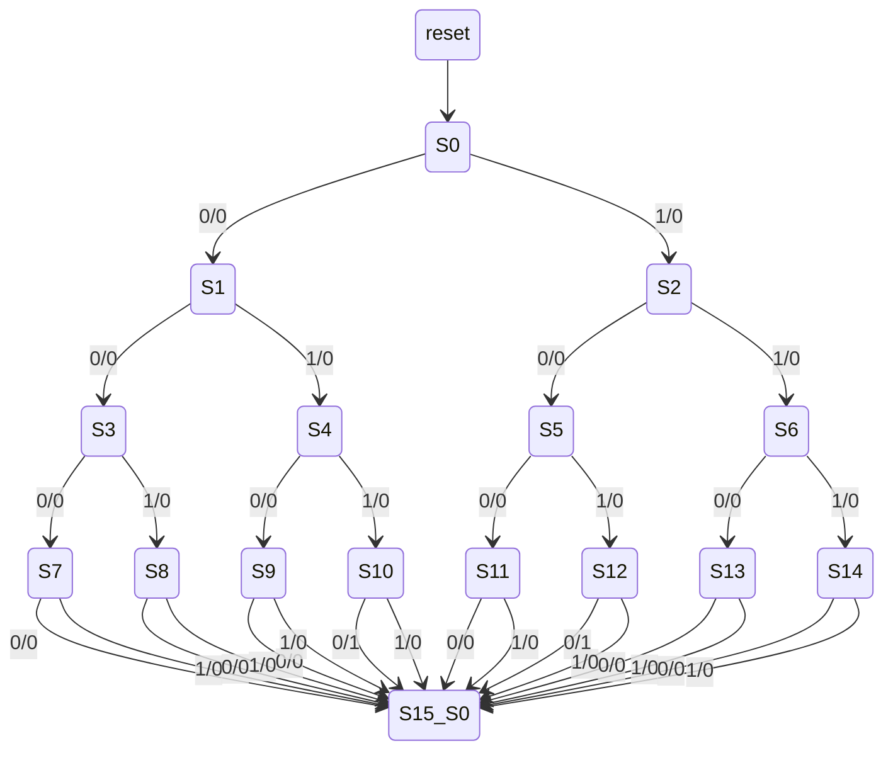

[[1739363674-state-reduction-algorithms|State Reduction Algorithms]]

# Row Matching Algorithm

An algorithm to reduce the number of states in a [[1739371932-finate-state-machine|FSM]]. 
It's core function is to apply the two rules of [[1739362540-equivalent-state|state equivalency]] by analyzing 
the [[1739370933-state-transition-table|state transition table]] 

> [!Algorithm]
> 1. Draw the state transition table
> 2. Identify the states with the same output, if none the state table has been reduced
> 3. If they have the same next states they are equivalent
> 4. Combine the equivalent states to only one entry in the state transition table
> 5. Go back to step 2

> [!TIP] Pro: Easy to implement

> [!CAUTION] Cons: the result table does not guarantee the minimal number of states.  

As an example we design a sequence matching FSM:
 - 1 input `x` 
 - 1 output `z` => output is `1` when the sequence is either `1010` `0110` 
 

The state diagram rapresent a [[1739380362-mealy-machine|Mealy machine]] analyzing the 
sequence starting from the LSB and by exploring the tree we get to the 
MSB.

> [!STEP]
> 1. Draw the state transition table

We now draw the stete transition table, we omit the fourth bit as we jump to `S0` and 
set te output value:
| Input Sequence | Current State | Next State (`x=0`) | Next State (`x=1`) | Output (`x=0`) | Output (`x=1`) |
|---------------|--------------|------------------|------------------|-------------|-------------|
| Reset        | S₀          | S₁              | S₂              | 0           | 0           |
| 0            | S₁          | S₃              | S₄              | 0           | 0           |
| 1            | S₂          | S₅              | S₆              | 0           | 0           |
| 00           | S₃          | S₇              | S₈              | 0           | 0           |
| 01           | S₄          | S₉              | S₁₀             | 0           | 0           |
| 10           | S₅          | S₁₁             | S₁₂             | 0           | 0           |
| 11           | S₆          | S₁₃             | S₁₄             | 0           | 0           |
| 000          | S₇          | S₀              | S₀              | 0           | 0           |
| 001          | S₈          | S₀              | S₀              | 0           | 0           |
| 010          | S₉          | S₀              | S₀              | 0           | 0           |
| 011          | S₁₀         | S₀              | S₀              | 1           | 0           |
| 100          | S₁₁         | S₀              | S₀              | 0           | 0           |
| 101          | S₁₂         | S₀              | S₀              | 1           | 0           |
| 110          | S₁₃         | S₀              | S₀              | 0           | 0           |
| 111          | S₁₄         | S₀              | S₀              | 0           | 0           |

 
> [!STEP] 
> 2. Identify the states with the same output => if none the state table has been reduced 
> 3. If they have the same next states they are equivalent

we can see that S₁₂ and S₁₀ have the same output for all the possible input sequences and they
transition to the same state S₀
| Input Sequence | Current State | Next State (`x=0`) | Next State (`x=1`) | Output (`x=0`) | Output (`x=1`) |
|---------------|--------------|------------------|------------------|-------------|-------------|
| 011          | S₁₀         | S₀              | S₀              | 1           | 0           |
| 101          | S₁₂         | S₀              | S₀              | 1           | 0           |

> [!STEP] 
> 4. Combine the equivalent states to only one entry in the state transition table

| Input Sequence | Current State | Next State (`x=0`) | Next State (`x=1`) | Output (`x=0`) | Output (`x=1`) |
|---------------|--------------|------------------|------------------|-------------|-------------|
| Reset        | S₀          | S₁              | S₂              | 0           | 0           |
| 0            | S₁          | S₃              | S₄              | 0           | 0           |
| 1            | S₂          | S₅              | S₆              | 0           | 0           |
| 00           | S₃          | S₇              | S₈              | 0           | 0           |
| 01           | S₄          | S₉              | S`₁₀             | 0           | 0           |
| 10           | S₅          | S₁₁             | S`₁₀             | 0           | 0           |
| 11           | S₆          | S₁₃             | S₁₄             | 0           | 0           |
| 000          | S₇          | S₀              | S₀              | 0           | 0           |
| 001          | S₈          | S₀              | S₀              | 0           | 0           |
| 010          | S₉          | S₀              | S₀              | 0           | 0           |
| 011 or 101   | S`₁₀         | S₀              | S₀              | 1           | 0           |
| 100          | S₁₁         | S₀              | S₀              | 0           | 0           |
| 110          | S₁₃         | S₀              | S₀              | 0           | 0           |
| 111          | S₁₄         | S₀              | S₀              | 0           | 0           |

> [!STEP] 
> 5. Go back to step 2 

> [!STEP] 
> 2. Identify the states with the same output => if none the state table has been reduced 
> 3. If they have the same next states they are equivalent

we can see that S₇, S₈, S₉, S₁₁, S₁₃ and S₁₄ have the same output for all the possible input 
sequences and they transition to the same state S₀

| Input Sequence | Current State | Next State (`x=0`) | Next State (`x=1`) | Output (`x=0`) | Output (`x=1`) |
|---------------|--------------|------------------|------------------|-------------|-------------|
| 000          | S₇          | S₀              | S₀              | 0           | 0           |
| 001          | S₈          | S₀              | S₀              | 0           | 0           |
| 010          | S₉          | S₀              | S₀              | 0           | 0           |
| 100          | S₁₁         | S₀              | S₀              | 0           | 0           |
| 110          | S₁₃         | S₀              | S₀              | 0           | 0           |
| 111          | S₁₄         | S₀              | S₀              | 0           | 0           |

> [!STEP] 
> 4. Combine the equivalent states to only one entry in the state transition table

| Input Sequence | Current State | Next State (`x=0`) | Next State (`x=1`) | Output (`x=0`) | Output (`x=1`) |
|---------------|--------------|------------------|------------------|-------------|-------------|
| Reset          | S₀          | S₁              | S₂              | 0           | 0           |
| 0              | S₁          | S₃              | S₄              | 0           | 0           |
| 1              | S₂          | S₅              | S₆              | 0           | 0           |
| 00             | S₃          | S`₇              | S`₇              | 0           | 0           |
| 01             | S₄          | S`₇              | S`₁₀             | 0           | 0           |
| 10             | S₅          | S`₇             | S`₁₀             | 0           | 0           |
| 11             | S₆          | S`₇             | S`₇            | 0           | 0           |
| not(011 or 101)| S`₇          | S₀              | S₀              | 0           | 0           |
| 011 or 101     | S`₁₀         | S₀              | S₀              | 1           | 0           |

> [!STEP] 
> 5. Go back to step 2

> [!STEP] 
> 2. Identify the states with the same output => if none the state table has been reduced
> 3. If they have the same next states they are equivalent

we can see that S₃ and S₆ have the same output for all the possible input 
sequences and they transition to the same state S`₇

| Input Sequence | Current State | Next State (`x=0`) | Next State (`x=1`) | Output (`x=0`) | Output (`x=1`) |
|---------------|--------------|------------------|------------------|-------------|-------------|
| 00             | S₃          | S`₇              | S`₇              | 0           | 0           |
| 11             | S₆          | S`₇             | S`₇            | 0           | 0           |

> [!STEP] 
> 4. Combine the equivalent states to only one entry in the state transition table

| Input Sequence | Current State | Next State (`x=0`) | Next State (`x=1`) | Output (`x=0`) | Output (`x=1`) |
|---------------|--------------|------------------|------------------|-------------|-------------|
| Reset          | S₀          | S₁              | S₂              | 0           | 0           |
| 0              | S₁          | S`₃              | S₄              | 0           | 0           |
| 1              | S₂          | S₅              | S`₃              | 0           | 0           |
| 00 or 11       | S`₃          | S`₇              | S`₇              | 0           | 0           |
| 01             | S₄          | S`₇              | S`₁₀             | 0           | 0           |
| 10             | S₅          | S`₇             | S`₁₀             | 0           | 0           |
| not(011 or 101)| S`₇          | S₀              | S₀              | 0           | 0           |
| 011 or 101     | S`₁₀         | S₀              | S₀              | 1           | 0           |

> [!STEP] 
> 5. Go back to step 2

> [!STEP] 
> 2. Identify the states with the same output => if none the state table has been reduced
> 3. If they have the same next states they are equivalent

we can see that S₄ and S₅ have the same output for all the possible input 
sequences and they transition to the same state:
 - when `x=0` => S`₇
 - when `x=1` => S`₁₀

| Input Sequence | Current State | Next State (`x=0`) | Next State (`x=1`) | Output (`x=0`) | Output (`x=1`) |
|---------------|--------------|------------------|------------------|-------------|-------------|
| 01             | S₄          | S`₇              | S`₁₀             | 0           | 0           |
| 10             | S₅          | S`₇             | S`₁₀             | 0           | 0           |

> [!STEP] 
> 4. Combine the equivalent states to only one entry in the state transition table

| Input Sequence | Current State | Next State (`x=0`) | Next State (`x=1`) | Output (`x=0`) | Output (`x=1`) |
|---------------|--------------|------------------|------------------|-------------|-------------|
| Reset          | S₀           | S₁              | S₂              | 0           | 0           |
| 0              | S₁           | S`₃             | S`₄              | 0           | 0           |
| 1              | S₂           | S`₄             | S`₃              | 0           | 0           |
| 00 or 11       | S`₃          | S`₇             | S`₇              | 0           | 0           |
| 01 or 10       | S`₄          | S`₇             | S`₁₀             | 0           | 0           |
| not(011 or 101)| S`₇          | S₀              | S₀              | 0           | 0           |
| 011 or 101     | S`₁₀         | S₀              | S₀              | 1           | 0           |

> [!STEP] 
> 5. Go back to step 2

we can now draw the final state diagram from the table 

Let's make an example with a table that the algorithm will not reduce but it is reducible: a parity
controller with 3 states 

| Current State | Next State (`x=0`) | Next State (`x=1`) | Output (`x=0`)| 
|-------------- |------------------|------------------|-------------|
| S₀            | S₀               | S₁               | 0           |  
| S₁            | S₁               | S₂               | 1           |   
| S₂            | S₂               | S₁               | 0           |

In chis case the step 2. will select the S₀ and S₂ states, but they can't be merged
for the 3rd step as they differ in next states. 
