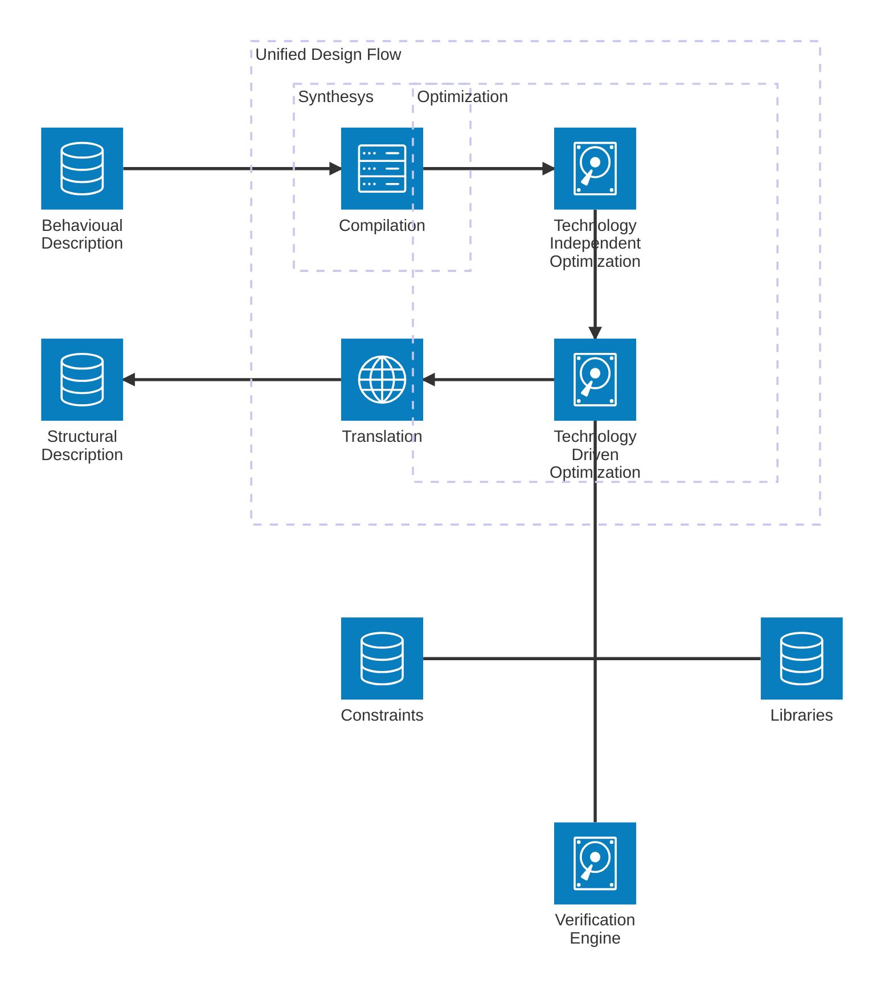

Discretization of 
- **Primitives**: Library based, a design is an interconnection of primitives
- **Optimization**: it is heuristic thus not all possible solution are visited/asserted

Abstraction
- Raise the design entry level => higher level descriptions 
- Sweeps from low level (More details) to high level (lower details) like programming languages

Discretization + Abstraction allows to define a design flow: **Unified Design Flow**. 
It is a multi level iterative process
1. [[1741793750-hardware-modeling|Hardware Modeling]]: describe the circuit
2. **Optimization**: refine the circuit
3. **Verification**: check:
    - Functionalities
    - Rules
These steps are managed with **Libraries** => Libraries are a collection of 
    macroresurces to achieve the level of given abstraction. Ex Logic 
    abstraction => Library= AND,OR,NOT

In the diagram Technology Independent Optimization is part of the Synthesis group but skill issue i guess i can't 
put it inside it.

todo: fix
no non va bene un cazzo qui rifai tutto
compilaiton 
    - [[1741794080-generic-boolean-network|Generic Boolean Network]]
tech. ind. opt and driven opt:
    - optimized [[1741794080-generic-boolean-network|Generic Boolean Network]]
translation:
- MBN: Mapped Boolean Network => 1:1 match between the local functions and the logic gates
    - each node can be implemented by a standard cell

# References
- [[1741601698-y-chart|Y Chart]]
- [[1741601723-design-space|Design Space]]
