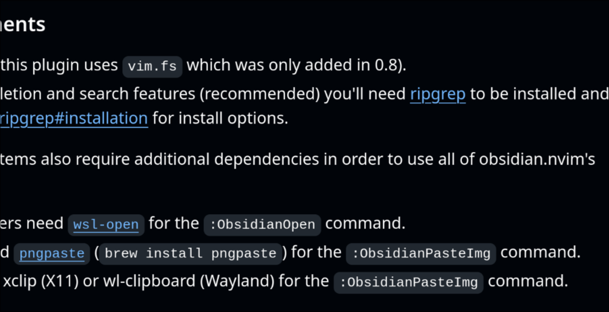

How i plan to structure my garden:
It's a mix between the PARA method and Zettelkasten.

 - Inbox contains all temp notes to be moved in other states
 - Projects: short term tasks (6 months)
 - Areas: Long term (Lifetime) projects
 - Uni: containts files that are indexes with some explenation
   between them (like a classic latex note would be), but in this way 
   the basic components are kept in the resurces state 
 - Resurces: pool of Atomic notes (Zettelkasten)
 - Journal: is to keep track of which notes i created on what day
 - Archive: all notes that i consider not usefoul anymore or not suited for 
   the other states 

